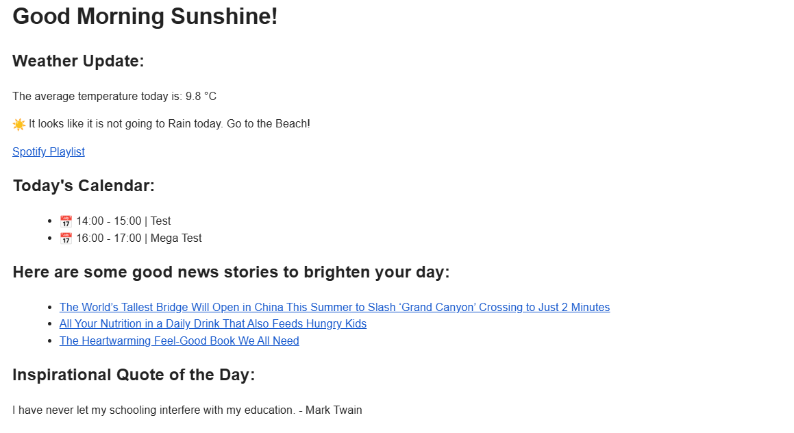

# morning-app

Welcome to my morning app, written in python and using 3 API services (Spotify Discontinued Song Recommendations based on Genre, otherwise would be 4) and 1 Scraper. The servides are as follows: Google Calendar API, Zen Quotes API, Weather API. The scraper is for a website called Good News, to get the latest collection of news articles (in this case a random list of them). Then it gets all of that data, and formats it into a neat email you can automate for your amazing, everyday morning routine.

1. Google API: requires a project and google Cloud API integration through Google Cloud Console. Using the free tier, that allows you to access the data in your google calendar. Need to connect your google account to this and create an OAuth token. Please read the Docs here: [Google API Docs](https://developers.google.com/workspace/docs/api/reference/rest)
2. Zen Quotes API: Relatively simple compared to google. Does not require authentication and just requires an API endpoint for a Random Quote. Nevertheless, find the docs here: [Zen Quotes Api Docs](https://docs.zenquotes.io/zenquotes-documentation/#api-structure)
3. Weather API: The classic free tier of weather data API. Requires registration, API key, and your latitude and longitude. You can find your coordinates through google maps, else sign up and read the docs here: [Weather API](https://openweathermap.org/api)
4. Good News Scraper: Quite easy, it just scrapes the site here: [Link To Good News](https://www.goodnewsnetwork.org/). I am rarely able to find good news throughout, so this website is a god send. For now the scraper targets it well, but might change in the future.

Potential improvements:
1. For now I hardcoded some spotify playlists into the weather forecast. I really want it to generate a random playlist based on genre, but having tried for a whole day I can comfortably say it is not possible at the moment. They depreciated some stuff in November 2024, and one of them was the recommendations API call. For now it is like that, but maybe I will find a workaround in the future.
2. It sends a neat email through SMTP library, but I thought could be cool to integrate WhatsApp aswell, as that is the main communications software I use.
3. I think I could have more weather options. For now if it does not rain I suggest going to the beach, but these are minor details I wanted to leave for later. The weather API gives back a loooot of data as well, so it could be endlessly cuistomisable. 
4. I tried a new structure for the project and this exam, but not sure if it is entirely industry correct. Would like to revise it and make it more clean.

Here is a screenshot of the Email Generated:
